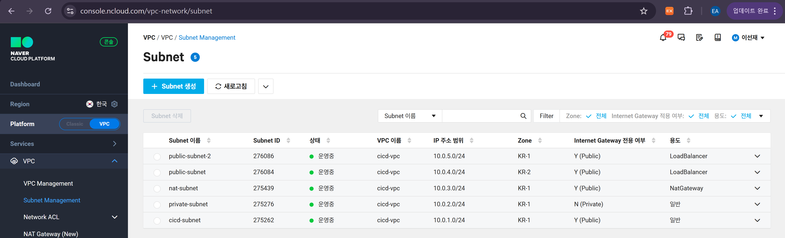
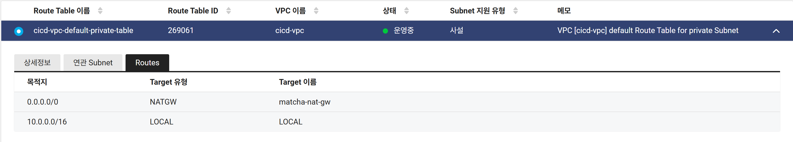
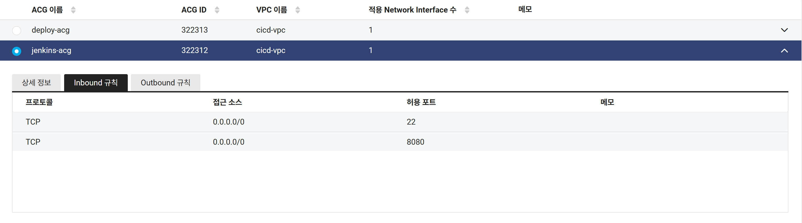
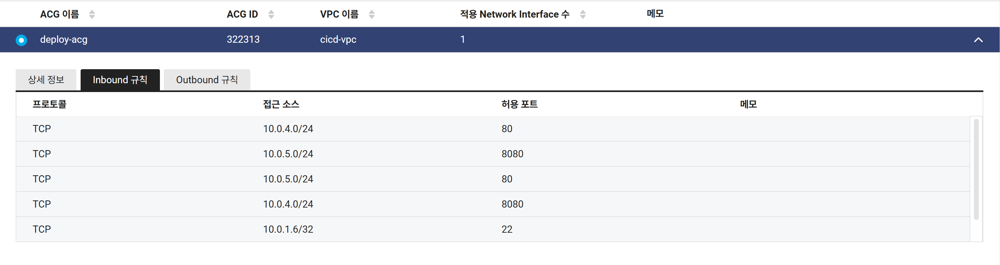
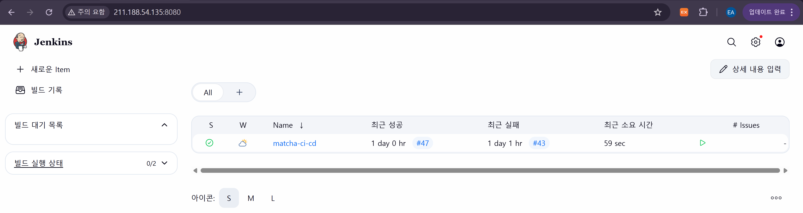
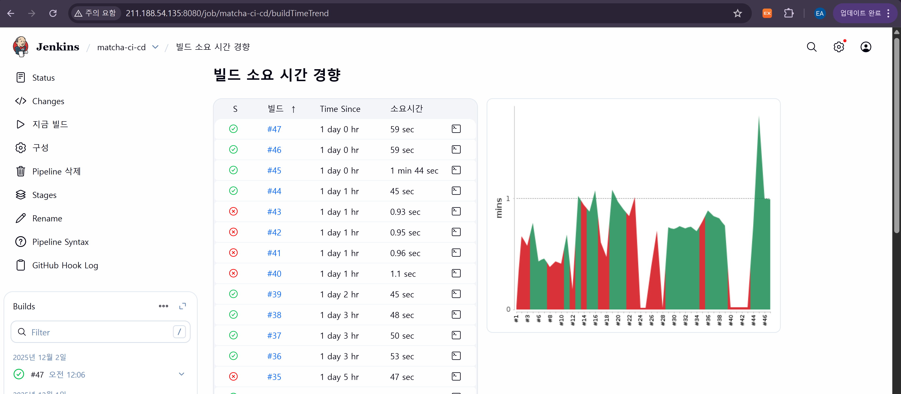
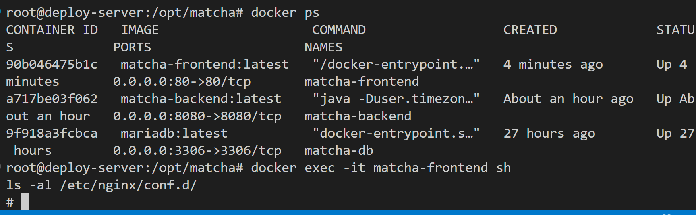
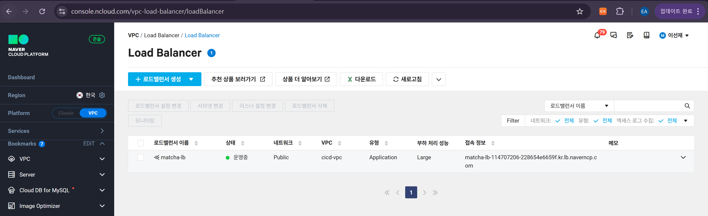
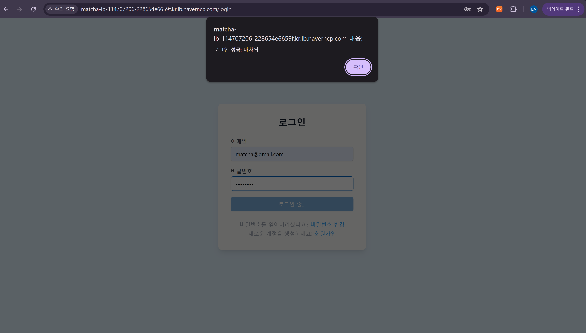
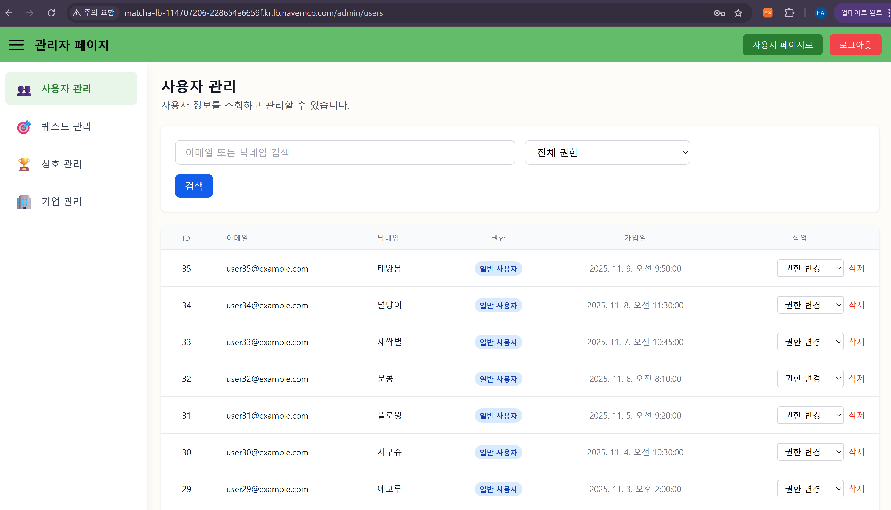

## 🚀 NCP 기반 DevOps CI/CD 파이프라인 구축

React + Spring Boot + Docker + Jenkins + LoadBalancer + NAT Gateway

본 프로젝트는 Naver Cloud Platform(NCP) 환경에서
Frontend(React) + Backend(Spring Boot) + MariaDB를 완전 자동화 CI/CD 파이프라인으로 배포하기 위해 설계

Jenkins는 Public Subnet, Deploy Server는 Private Subnet,
Backend는 LoadBalancer를 통해 외부 공개,
Frontend는 Deploy Server 내부 80 포트에서만 제공 (Internal Only) 되는 구조

### 📌 1. 전체 아키텍처 개요

아래는 시스템의 전체 CI/CD 동작 흐름

✔ CI/CD 전체 동작 흐름
| 번호 | 동작 |
|------|-------------------------------------------------------------|
| 1 | 개발자가 GitHub에 코드 push |
| 2 | GitHub Webhook ➜ Jenkins 파이프라인 트리거 |
| 3 | Jenkins가 GitHub 소스를 pull |
| 4 | Jenkins가 Backend / Frontend 빌드 |
| 5 | Jenkins Docker 이미지 build |
| 6 | Docker 이미지를 tar 파일로 export |
| 7 | Jenkins ➜ Deploy Server로 이미지 전송 |
| 8 | Deploy Server에서 docker load ➜ 컨테이너 실행 |
| 9 | Backend 컨테이너가 Load Balancer Target Group에 연결됨 |
| 10 | Client Browser ➜ LB ➜ Backend(8080) 호출 |

🏗 전체 NCP 아키텍처 다이어그램  


### 🧱 2. 네트워크 구성 (VPC / Subnet / Routing / NAT)
✔ 2-1) VPC 구성 정보
| 항목 | 값 |
|------|--------------------|
| VPC CIDR | 10.0.0.0/16 |
| 목적 | Jenkins 서버, Deploy 서버, NAT, LB 영역 분리 |

✔ 2-2) Subnet 구성
| Subnet | CIDR | Zone | 역할 |
|--------|-----------|------|---------------------------|
| cicd-subnet | 10.0.1.0/24 | KR-1 | Jenkins Server (Public) |
| private-subnet | 10.0.2.0/24 | KR-1 | Deploy Server (Private) |
| nat-subnet | 10.0.3.0/24 | KR-1 | NAT Gateway |
| public-subnet-1 | 10.0.4.0/24 | KR-2 | LoadBalancer Zone A |
| public-subnet-2 | 10.0.5.0/24 | KR-1 | LoadBalancer Zone B |


📸 Subnet UI 캡처 삽입 위치



✔ 2-3) Routing Table
🔸 Private Subnet Routing
| 목적지 | Target | 설명 |
|--------|-------------|---------------------------|
| 0.0.0.0/0 | NAT Gateway | Private 서버가 외부 연결을 위해 사용 |
| 10.0.0.0/16 | LOCAL | 내부 통신 |


📸 NAT Gateway 이미지



### 🔐 3. 보안 구성 (ACG)
✔ 3-1) Jenkins ACG
| 프로토콜 | 포트 | 출처 |
|---------|------|----------------|
| TCP | 22 | 0.0.0.0/0 |
| TCP | 8080 | 0.0.0.0/0 |

✔ 3-2) Deploy Server ACG
| 포트 | 출처 | 설명 |
|------|----------------|------------------------------|
| 22 | Jenkins 서버 IP | SSH 자동 배포 |
| 80 | LoadBalancer Subnet | Frontend 내부 호출 |
| 8080 | LoadBalancer Subnet | Backend API |
| 3306 | Private Only | DB 내부 통신 |


📸 ACG UI 이미지





### 🏛 4. 서버 구성
| 서버명 | Private IP | Public IP | 역할 |
|--------|-------------|-----------|---------------------------|
| Jenkins Server | 10.0.1.6 | 211.188.54.xxx | 빌드 / Dockerize |
| Deploy Server | 10.0.2.6 | ❌ 없음 | 운영 docker-compose 서버 |

### 🧰 5. Jenkins CI/CD 파이프라인 구성
✔ 전체 흐름 요약
1) GitHub → Jenkins Checkout  
2) Backend Gradle Build  
3) Frontend Build  
4) Docker Build  
5) Docker Save (.tar)  
6) Deploy Server로 파일 전송  
7) docker load 후 컨테이너 재기동


📸 Jenkins UI 이미지




📸 Jenkins Build Trend



✔ Jenkinsfile 요약 버전
```groovy  
pipeline {
  agent any

  stages {
    stage('Checkout') {
      steps { checkout scm }
    }
    stage('Build Backend') {
      steps { sh './gradlew clean build -x test' }
    }
    stage('Build Frontend') {
      steps { sh 'cd frontend && npm install && npm run build' }
    }
    stage('Docker Build') {
      steps { sh 'docker build -t matcha-backend ./backend' }
    }
    stage('Deploy') {
      steps {
        sh 'scp backend.tar root@10.0.2.6:/opt/matcha'
        sh 'ssh root@10.0.2.6 "docker load < backend.tar && docker-compose up -d"'
      }
    }
  }
}
```

### 🐳 6. Deploy Server (docker-compose)
```groovy  
version: "3.8"

services:
  backend:
    image: matcha-backend:latest
    ports:
      - "8080:8080"

  frontend:
    image: matcha-frontend:latest
    ports:
      - "80:80"

  db:
    image: mariadb:10.6
    environment:
      MYSQL_ROOT_PASSWORD: 1234
```

📸 docker-compose 실행 화면



### 🌐 7. LoadBalancer 구성
| 항목 | 값 |
|------|-----------------------------|
| LB Subnets | public-subnet-1, public-subnet-2 |
| Target Group | Deploy Server Backend(8080) |
| Health Check | /actuator/health |


📸 LB Health Check 화면




### 🎉 8. 서비스 결과 화면





### 📝 9. 전체 프로젝트 구조
PORTFOLIO          
 ├── Deploy            
 │   ├── AWS            
 │   ├── GCP           
 │   └── NCP    ← 본 문서 설명          
 ├── Matcha     ← ESG FullStack App           
 ├── Jenkinsfile               
 └── README.md                      

### ⭐ 10. 핵심 요약 
✔ NCP 기반 실무형 DevOps CI/CD 구축  
✔ Jenkins Public + Deploy Private 구조로 보안 강화  
✔ NAT Gateway 기반 Private Subnet 외부 통신 구성  
✔ LoadBalancer로 Backend 안정적 서비스 제공  
✔ Docker 기반 자동 빌드/배포 파이프라인 구축  
✔ GitHub → Jenkins → Deploy → LB까지 완전 자동화
